# OpenSpec + SuperPowers + OMO 融合工作流

<HARD-GATE>
每个 Phase 之间的转换必须满足明确的 Gate 条件。AI 不得自行跳过。
</HARD-GATE>

<IRON-LAW>
NO PRODUCTION CODE WITHOUT TDD TEST FIRST
</IRON-LAW>

## 设计原则

| 原则 | OpenSpec 提供 | SuperPowers 提供 | OMO 提供 |
|------|-------------|-----------------|---------|
| **explore** | 上下文检查 | brainstorming 轻量模式 | — |
| **propose** | artifact 模板、Delta Specs | brainstorming 完整模式、writing-plans | Metis 隐藏问题分析、Momus 计划审查 |
| **apply** | tasks 列表、进度追踪 | TDD、verification | Hephaestus x5 并行执行 |

## 前置检测（自动修复）

每次调用 `/lsh-opsx-sp-omo` 时，AI 必须自动执行以下检测。**检测失败时自动修复，无需用户干预。**

| 检测项 | 验证方式 | 失败处理 |
|--------|----------|----------|
| **openspec CLI** | `openspec --version` 返回版本号 | 自动：`npm install -g @fission-ai/openspec@latest` |
| **openspec 初始化** | `openspec/` 目录存在 | 自动：`openspec init --tools opencode` |
| **Git 仓库** | `git rev-parse --is-inside-work-tree` 返回 true | 自动：`git init` |

**执行流程**：
```
1. 检测 openspec CLI → 失败则自动安装 → 重试验证
2. 检测 openspec/ 目录 → 失败则自动初始化 → 重试验证
3. 检测 git 仓库 → 失败则自动初始化
4. 全部通过 → 继续执行
```

> **注意**：如果自动修复失败（例如网络问题权限问题），才提示用户手动处理。

## 命令

单一入口 `/lsh-opsx-sp-omo`，根据输入自动路由：

```
/lsh-opsx-sp-omo 优化选股性能       → 新建变更，完整流程 explore → propose → apply
/lsh-opsx-sp-omo apply:feat-auth     → 执行 apply（支持断点续传）
/lsh-opsx-sp-omo propose:feat-auth  → 执行 propose（需先完成 explore）
/lsh-opsx-sp-omo reset:feat-auth    → 重置变更
/lsh-opsx-sp-omo archive:feat-auth  → 查看/执行归档
/lsh-opsx-sp-omo continue:feat-auth → 继续中断的变更（apply 的语义别名）
```

**无前缀处理规则**：无前缀输入强制执行完整流程（explore → propose → apply），中间每个 Gate 需用户确认。

## 3 Phase 概览

```
Phase 1: explore    → brainstorming 轻量模式（SuperPowers）
Phase 2: propose   → OpenSpec CLI + SuperPowers + OMO Metis/Momus
Phase 3: apply     → OMO Hephaestus x5 并行 + SuperPowers TDD
```

## OMO 智能体调用

### 顾问型智能体（subagent_type 直接调用）

| 智能体 | 调用方式 | 用途 |
|--------|---------|------|
| Metis | `task(subagent_type: "metis")` | design.md 隐藏问题分析 |
| Momus | `task(subagent_type: "momus")` | tasks.md 计划审查 |
| Oracle | `task(subagent_type: "oracle")` | 架构决策/调试（按需） |
| Librarian | `task(subagent_type: "librarian")` | 文档/代码搜索 |
| Explore | `task(subagent_type: "explore")` | 快速代码探索 |

### 执行型智能体（x5 并行）

| 智能体 | 调用方式 | 用途 |
|--------|---------|------|
| Hephaestus | `task(subagent_type: "hephaestus")` x5 | TDD 循环并行执行 |

### 不可调用的智能体

| 智能体 | 原因 | 替代方案 |
|--------|------|---------|
| Prometheus | internal planner，仅供 Sisyphus 内部使用 | Metis（pre-planning） |
| Atlas | primary mode，不可作为 subagent | 手动任务编排 |
| Sisyphus | primary mode，主编排器 | skill: finishing-a-development-branch |

详细说明见 `agents.md`。

## Process Flow

```dot
digraph opsx_fusion_omo {
    rankdir=LR;
    "用户输入" -> "检测前缀" [label="有前缀"];
    "用户输入" -> "关键词检测" [label="无前缀"];
    "检测前缀" -> "执行对应操作";
    "关键词检测" -> "路由到 Phase";

    "Phase 1: explore" -> "SuperPowers brainstorming" [label="轻量模式"];
    "SuperPowers brainstorming" -> "Gate-1" [label="用户确认"];
    "Gate-1" -> "Phase 2: propose" [label="继续/提案"];

    "Phase 2: propose" -> "openspec instructions" [label="获取模板"];
    "openspec instructions" -> "SuperPowers brainstorming" [label="完整模式"];
    "SuperPowers brainstorming" -> "task(Metis)" [label="隐藏问题"];
    "task(Metis)" -> "Delta Specs" [label="Given/When/Then"];
    "Delta Specs" -> "design.md" [label="OpenSpec 模板"];
    "design.md" -> "Gate-2" [label="用户确认"];
    "Gate-2" -> "SuperPowers writing-plans" [label="TDD 任务"];
    "SuperPowers writing-plans" -> "task(Momus)" [label="计划审查"];
    "task(Momus)" -> "tasks.md" [label="TDD 五步"];
    "tasks.md" -> "Gate-3" [label="用户确认"];
    "Gate-3" -> "Phase 3: apply" [label="开始实现"];

    "Phase 3: apply" -> "openspec instructions apply" [label="获取任务"];
    "openspec instructions apply" -> "git-worktree" [label="隔离环境"];
    "git-worktree" -> "task(Hephaestus) x5" [label="并行执行"];
    "task(Hephaestus) x5" -> "双重验证" [label="TDD 循环"];
    "双重验证" -> "finishing" [label="Git commit"];
    "finishing" -> "Gate-4" [label="用户确认"];
    "Gate-4" -> "完成" [label="archive"];
}
```



## Gate 机制

| Gate | Phase 转换 | 触发方式 |
|------|-----------|----------|
| Gate-1 | explore → propose | 用户回复"继续"或"开始提案" |
| Gate-2 | design → tasks | 用户回复"同意"或"需要修改" |
| Gate-3 | tasks → apply | 用户回复"开始实现"或"需要调整" |
| Gate-4 | finishing → archive | 用户回复"确认归档"或"取消归档" |

## Guardrails

- **强制 brainstorming**：propose 阶段必须经过 SuperPowers brainstorming 需求澄清
- **强制 CLI 模板**：用 `openspec instructions` 获取 artifact 模板，不自由发挥
- **强制 TDD**：apply 阶段每个任务必须先写测试
- **强制 debugging**：TDD 测试失败时必须找根因
- **强制 code-review**：每个任务完成后必须审查
- **强制 git-worktree**：apply 在隔离环境中执行
- **强制 finishing**：apply 完成后必须走合并流程
- **强制 Gate 检查**：每个 phase 结束后必须验证 Gate 条件
- **强制 OMO 审查**：propose 阶段必须经过 Metis/Momus 审查

## Red Flags - 停止并重来

| 标志 | 含义 | 行动 |
|------|------|------|
| 用户未确认 Gate 就继续 | 违反显式确认原则 | 停止，等确认 |
| 跳过 TDD 直接写代码 | 违反 Iron Law | 停止，重写测试 |
| 跳过 brainstorming/spec-review/code-review | 违反质量保障流程 | 停止，补做审查 |
| 跳过 Metis/Momus 审查 | 违反 OMO 增强原则 | 停止，补做审查 |
| 不用 CLI 获取模板 | 违反融合原则 | 停止，用 `openspec instructions` |
| 验证失败继续执行 | 可能引入缺陷 | 停止，修复问题 |

## 递进读取指引

### explore 阶段
→ 读取 `phases-explore.md`

### propose 阶段
→ 读取 `phases-propose.md` + `agents.md`

### apply 阶段
→ 读取 `phases-apply.md` + `gates.md` + `agents.md`

### reset 阶段
→ 读取 `phases-reset.md`

## 与其他 Skill 的关系

| Skill | 关系 | 说明 |
|-------|------|------|
| lsh-opsx-sp | 简化版 | 不使用 OMO 智能体，直接调用 SuperPowers skills |
| openspec-explore | 单阶段 | OpenSpec 官方 explore |
| openspec-propose | 单阶段 | OpenSpec 官方 propose |
| openspec-apply-change | 单阶段 | OpenSpec 官方 apply |
| openspec-archive-change | 单阶段 | OpenSpec 官方 archive |
| brainstorming | 依赖 | SuperPowers 需求澄清 |
| test-driven-development | 依赖 | SuperPowers TDD 执行 |
| verification-before-completion | 依赖 | SuperPowers 验证 |
