# OpenSpec + SuperPowers 融合工作流

<HARD-GATE>
每个 Phase 之间的转换必须满足明确的 Gate 条件。AI 不得自行跳过。
</HARD-GATE>

<IRON-LAW>
NO PRODUCTION CODE WITHOUT TDD TEST FIRST
</IRON-LAW>

## 设计原则

| 原则 | 说明 |
|------|------|
| **OpenSpec 骨架** | 变更结构、artifact 依赖、Delta Specs |
| **SuperPowers 填充** | brainstorming 需求澄清、TDD 五步任务、verification |
| **TDD 强制** | apply 阶段每个任务必须先写测试 |
| **CLI 模板** | 用 `openspec instructions` 获取 artifact 模板，不用自由发挥 |

## 前置检测（自动修复）

每次调用 `/lsh-opsx-sp` 时，AI 必须自动执行以下检测。**检测失败时自动修复，无需用户干预。**

| 检测项 | 验证方式 | 失败处理 |
|--------|----------|----------|
| **openspec CLI** | `openspec --version` 返回版本号 | 自动：`npm install -g @fission-ai/openspec@latest` |
| **openspec 初始化** | `openspec/` 目录存在 | 自动：`openspec init --tools opencode` |
| **Git 仓库** | `git rev-parse --is-inside-work-tree` 返回 true | 自动：`git init` |

**执行流程**：
```
1. 检测 openspec CLI → 失败则自动安装 → 重试验证
2. 检测 openspec/ 目录 → 失败则自动初始化 → 重试验证
3. 检测 git 仓库 → 失败则自动初始化
4. 全部通过 → 继续执行
```

> **注意**：如果自动修复失败（例如网络问题权限问题），才提示用户手动处理。

---

## 命令

单一入口 `/lsh-opsx-sp`，根据输入自动路由：

```
/lsh-opsx-sp 优化选股性能       → 新建变更，完整流程 explore → propose → apply
/lsh-opsx-sp apply:feat-auth     → 执行 apply（自动检测状态，支持断点续传）
/lsh-opsx-sp propose:feat-auth  → 执行 propose（需先完成 explore）
/lsh-opsx-sp reset:feat-auth    → 重置变更（删除 worktree）
/lsh-opsx-sp archive:feat-auth  → 查看/执行归档
/lsh-opsx-sp continue:feat-auth  → 继续中断的变更（apply 的语义别名）
```

**无前缀处理规则**：无前缀输入强制执行完整流程（explore → propose → apply），中间每个 Gate 需用户确认。

## 3 Phase 概览

```
Phase 1: explore    → brainstorming 轻量模式（SuperPowers）
Phase 2: propose   → OpenSpec CLI 获取模板 + SuperPowers brainstorming
Phase 3: apply     → OpenSpec tasks + SuperPowers TDD 执行
```

### 关键融合点

| Phase | OpenSpec 提供 | SuperPowers 提供 |
|-------|-------------|-----------------|
| **explore** | 上下文检查（openspec list） | brainstorming 轻量模式 |
| **propose** | artifact 模板（CLI）<br>Delta Specs 格式<br>proposal/design/tasks 结构 | brainstorming 完整模式<br>writing-plans 生成 TDD 任务<br>spec self-review |
| **apply** | tasks.md 列表<br>进度追踪<br>变更目录结构 | test-driven-development<br>verification-before-completion<br>finishing-a-development-branch |

## Process Flow

```dot
digraph opsx_fusion {
    rankdir=LR;
    "用户输入" -> "检测前缀" [label="有前缀"];
    "用户输入" -> "关键词检测" [label="无前缀"];
    "检测前缀" -> "执行对应操作";
    "关键词检测" -> "路由到 Phase";

    "Phase 1: explore" -> "SuperPowers brainstorming" [label="轻量模式"];
    "SuperPowers brainstorming" -> "Gate-1" [label="用户确认"];
    "Gate-1" -> "Phase 2: propose" [label="继续/提案"];

    "Phase 2: propose" -> "openspec instructions" [label="获取模板"];
    "openspec instructions" -> "SuperPowers brainstorming" [label="完整模式"];
    "SuperPowers brainstorming" -> "Delta Specs" [label="Given/When/Then"];
    "Delta Specs" -> "design.md" [label="OpenSpec 模板"];
    "design.md" -> "Gate-2" [label="用户确认"];
    "Gate-2" -> "SuperPowers writing-plans" [label="TDD 任务"];
    "SuperPowers writing-plans" -> "tasks.md" [label="TDD 五步"];
    "tasks.md" -> "Gate-3" [label="用户确认"];
    "Gate-3" -> "Phase 3: apply" [label="开始实现"];

    "Phase 3: apply" -> "openspec instructions apply" [label="获取任务"];
    "openspec instructions apply" -> "状态检测" [label="检查 worktree"];
    "状态检测" -> "worktree 存在?" [shape=diamond];
    "worktree 存在?" -> "询问继续/跳过/重置" [label="是"];
    "worktree 存在?" -> "创建新 worktree" [label="否"];
    "询问继续/跳过/重置" -> "继续执行" [label="继续"];
    "询问继续/跳过/重置" -> "跳过阻塞任务" [label="跳过"];
    "创建新 worktree" -> "TDD 循环";
    "继续执行" -> "TDD 循环";
    "TDD 循环" -> "双重验证" [label="每任务"];
    "双重验证" -> "进度保存" [label="每3任务"];
    "进度保存" -> "TDD 循环";
    "进度保存" -> "finishing" [label="完成"];
    "遇到阻塞" -> "保存状态" [label="立即"];
    "保存状态" -> "询问处理方式" [label="用户"];
    "询问处理方式" -> "继续等待" [label="等待"];
    "询问处理方式" -> "跳过任务" [label="跳过"];
    "询问处理方式" -> "退出" [label="取消"];
    "finishing" -> "Gate-4" [label="用户确认"];
    "Gate-4" -> "完成" [label="archive"];
}
```



## Gate 机制

| Gate | Phase 转换 | 触发方式 |
|------|-----------|---------|
| Gate-1 | explore → propose | 用户回复"继续"或"开始提案" |
| Gate-2 | design → tasks | 用户回复"同意"或"需要修改" |
| Gate-3 | tasks → apply | 用户回复"开始实现"或"需要调整" |
| Gate-4 | finishing → archive | 用户回复"确认归档"或"取消归档" |

## Guardrails

- **强制 brainstorming**：propose 阶段必须经过 SuperPowers brainstorming 需求澄清
- **强制 CLI 模板**：用 `openspec instructions` 获取 artifact 模板，不自由发挥
- **强制 TDD**：apply 阶段每个任务必须先写测试
- **强制 debugging**：TDD 测试失败时必须找根因
- **强制 code-review**：每个任务完成后必须审查
- **强制 git-worktree**：apply 在隔离环境中执行
- **强制 finishing**：apply 完成后必须走合并流程
- **强制 Gate 检查**：每个 phase 结束后必须验证 Gate 条件

## Red Flags - 停止并重来

| 标志 | 含义 | 行动 |
|------|------|------|
| 用户未确认 Gate 就继续 | 违反显式确认原则 | 停止，等确认 |
| 跳过 TDD 直接写代码 | 违反 Iron Law | 停止，重写测试 |
| 跳过 brainstorming/spec-review/code-review | 违反质量保障流程 | 停止，补做审查 |
| 不用 CLI 获取模板 | 违反融合原则 | 停止，用 `openspec instructions` |
| 验证失败继续执行 | 可能引入缺陷 | 停止，修复问题 |

## 递进读取指引

### explore 阶段
→ 读取 `phases-explore.md`

### propose 阶段
→ 读取 `phases-propose.md`

### apply 阶段
→ 读取 `phases-apply.md` + `gates.md`

### reset 阶段
→ 读取 `phases-reset.md`

## 与其他 Skill 的关系

| Skill | 关系 | 说明 |
|-------|------|------|
| openspec-explore | 单阶段 | OpenSpec 官方 explore |
| openspec-propose | 单阶段 | OpenSpec 官方 propose |
| openspec-apply-change | 单阶段 | OpenSpec 官方 apply |
| openspec-archive-change | 单阶段 | OpenSpec 官方 archive |
| brainstorming | 依赖 | SuperPowers 需求澄清 |
| test-driven-development | 依赖 | SuperPowers TDD 执行 |
| verification-before-completion | 依赖 | SuperPowers 验证 |
| lsh-opsx-sp-omo | 整合版 | OMO 智能体 + 融合工作流 |
